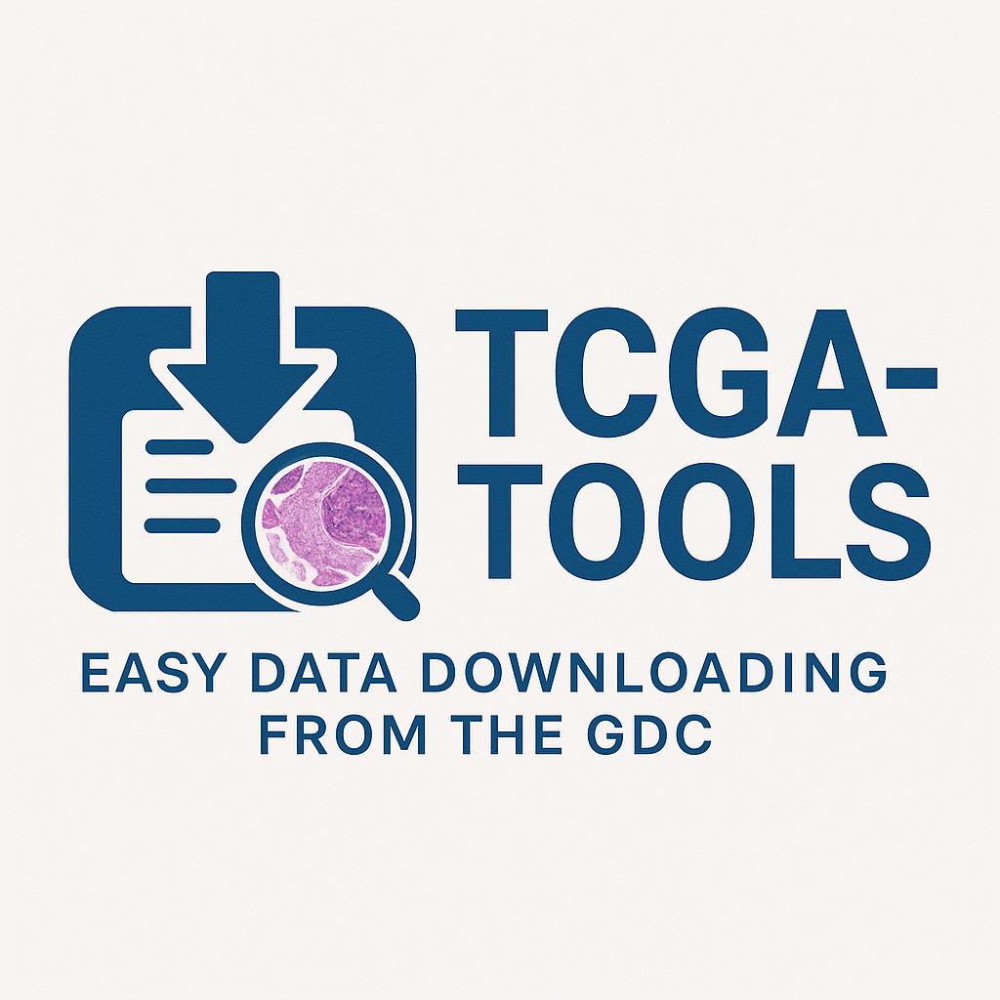

**TCGA-Tools** is a lightweight, Pythonic wrapper around the NCI GDC (Genomic Data Commons) API for quickly pulling TCGA data and ready-to-use annotations.

<p align="center">
  
</p>

## Goals
- Simple one-liner to fetch project files (e.g., whole-slide images / `.svs`).
- Write analysis-ready CSVs with file metadata and patient grouping.
- Emit optional annotation CSVs: clinical (survival/outcomes/treatments), molecular (DNA/RNA/CNV/methylation), free-text reports, and diagnosis/subtype.
- Be resilient to missing or sparse fields across projects.

## Install
```bash
pip install -e .
# deps: requests pandas tqdm
```

## Quickstart
```python
import tcga_tools as tt

# Download WSIs and all annotations for TCGA-LUSC
artifacts = tt.Download(
    dataset_name="TCGA-LUSC",
    filetypes=[".svs"],
    annotations=["all"],
    output_dir="./TCGA-LUSC"
)
```
Artifacts include:
- `data/` (downloads)
- `files_metadata.csv` (flattened file + case/sample fields)
- `groups.csv` (per-case: paired / tumor_only / normal_only)
- `clinical.csv`, `molecular_index.csv`, `reports_index.csv`, `diagnosis.csv` (if requested)
- `gdc_manifest.tsv` (for the GDC Transfer Tool)

## Authentication
If you need controlled-access files, set an environment variable with your token:
```bash
export GDC_TOKEN="<your token>"
```

## Annotations argument
Pass any subset of:
- `"clinical"` — survival/clinical outcome/treatment effect (diagnoses, treatments, follow-ups, exposures)
- `"molecular"` — DNA/RNA/CNV/Methylation file index
- `"report"` — free-text/clinical/pathology reports (XML/PDF)
- `"diagnosis"` — diagnostic subtype, morphology, stage/grade
- `"all"` — everything above

## Handling missing data
GDC projects vary in completeness. TCGA-Tools is defensive:
- Broad field requests; if the API rejects fields (HTTP 400), it **retries without fields** to maximize returned content.
- JSON is **flattened** into wide CSVs; absent fields simply do not appear, or appear with empty values.
- Grouping logic remains robust even if sample types are missing.

## CLI
```bash
python -m tcga_tools --dataset TCGA-LUSC --filetypes .svs \
  --annotations clinical molecular report diagnosis --out ./TCGA-LUSC
```

## Testing
Unit tests use a fake client (no network):
```bash
pytest -q
```

## Notes
- For very large downloads, prefer the emitted `gdc_manifest.tsv` with the GDC Data Transfer Tool.
- Extend `config.py` to add/modify field lists or filetype preferences as needed.

